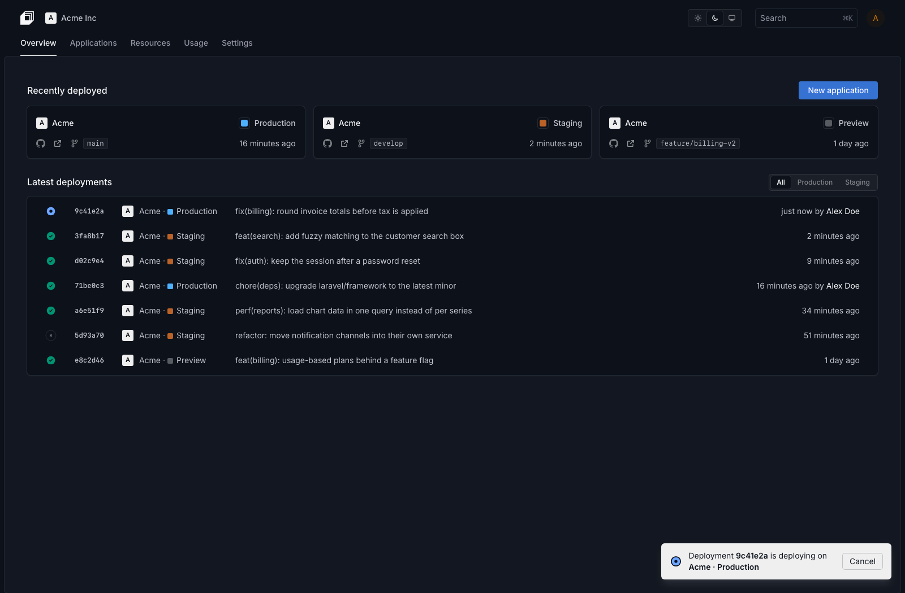
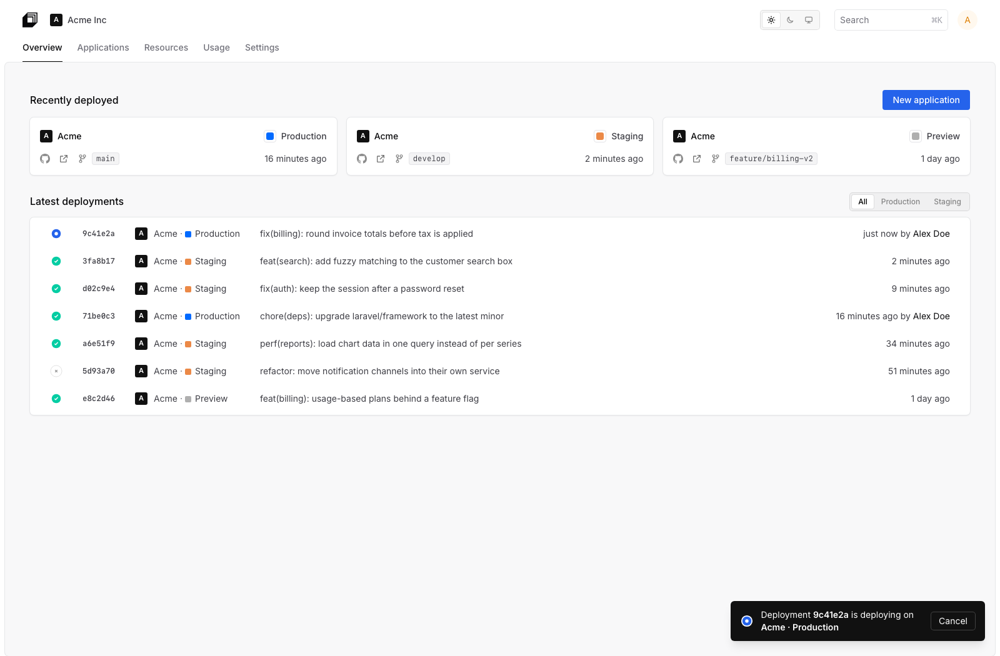

<p align="center"></p>

<h1 align="center">Laravel Cloud Dark</h1>

<p align="center">Dark mode and a cleaner dashboard for <a href="https://cloud.laravel.com">Laravel Cloud</a>.</p>

<p align="center"></p>

## Features

- **Dark mode** that follows the macOS appearance, with a soft navy tint.
- **Theme switch** next to Search in the header: Light, Dark or System. Your choice is remembered.
- **3-column app grid** for "Recently deployed" on screens 1280px and wider.
- **Production first**: cards sort Production, then Staging, then the rest.
- **One-row cards**: GitHub icon, open-site icon, branch and deploy time on one line. The branch opens on GitHub. Icons show a tooltip on hover.
- **Deploy list filter**: All, Production or Staging. Each row shows its environment color and the full commit title.
- **Deploy status in the tab icon**: a blue dot while a deploy runs, a red dot when the last deploy of an environment failed.
- **Tighter layout**: smaller corners site-wide, less space at the top, toasts in the bottom-right corner.
- **Less noise**: the large org title above "Recently deployed" is hidden.
- **Primary button**: "New application" is bright blue.

Images, logos and avatars keep their real colors in dark mode.

<p align="center"></p>

Screenshots use a demo "Acme" org.

## Install

Works in Chrome, Brave, Edge, Arc and other Chromium browsers.

1. Clone the repo, or download a zip from Releases and unzip it.
2. Open `chrome://extensions` (or `brave://extensions`).
3. Turn on **Developer mode**.
4. Click **Load unpacked** and select the repo folder.
5. Open [cloud.laravel.com](https://cloud.laravel.com).

To update, pull the latest changes and click the reload icon on the extension card.

## How it works

- `dark.js` compares the page theme with your preference. If they differ, it sets `data-lcd` on `<html>`.
- `dark.css` inverts the page for that attribute, then inverts images again so they keep their colors.
- Laravel Cloud has no stable class names, so the script finds elements by their text ("Recently deployed", "Search", "New application") and tags them with `data-lcd-*` attributes. The CSS styles those attributes.
- A `MutationObserver` reapplies the tags after in-app navigation.

## Privacy

The extension runs only on `https://cloud.laravel.com/*`. It requests no permissions, makes no network requests and collects no data. The theme, deploy filter and environment colors are stored in the page's `localStorage` under `lcd-theme`, `lcd-env` and `lcd-env-colors`.

## Development

Edit `dark.css` or `dark.js`, then reload the extension and refresh Cloud.

Build a Chrome Web Store upload zip:

```sh
./package.sh
```

The zip lands in `dist/` and is named after the version in `manifest.json`.

## Notes

This is an unofficial extension. It is not affiliated with Laravel. Laravel Cloud markup changes can break the layout tweaks; the dark mode keeps working.
